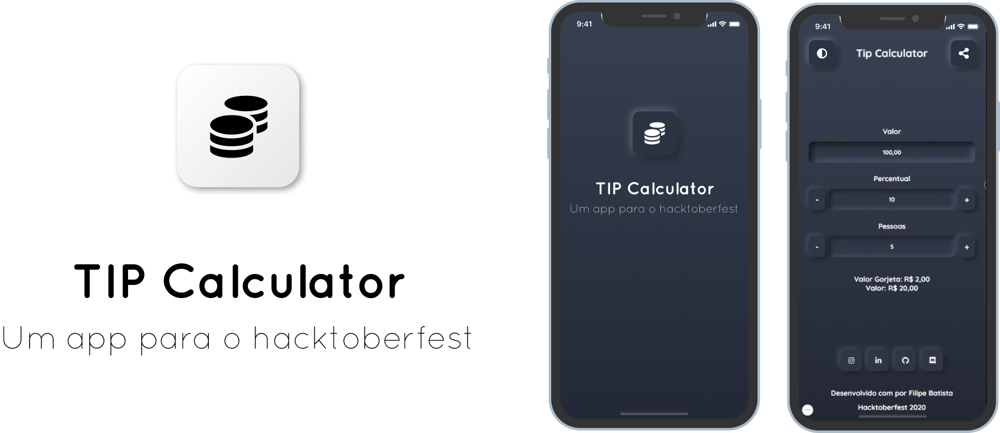

# Indice

- [Sobre](#-sobre)
- [Aprendizados](#Aprendizados)
- [Download](#Download)
- [Como baixar o projeto](#-como-baixar-o-projeto)

## 🔖&nbsp; Sobre

Projeto desenvolvido para participar do [hacktoberfest](https://hacktoberfest.digitalocean.com/) da Digital Ocean. Desafio desenvolvido pela comunidade do [DevChallenge](https://discord.gg/yvYXhGj), se quiser pode acessar o site e ver os desafios feitos para a comunidade do DevChallenge [AQUI](https://www.devchallenge.com.br/).

## Sobre o hacktoberfest
 O Hacktoberfest é uma celebração do software de código aberto que dura um mês, onde desenvolvedores têm a oportunidade de retribuir os projetos que gostam e outros que acabaram de descobrir, além de praticar seus conhecimentos e fazer networking com as comunidades.

 Além de contribuir para o crescimento do open source e fazer contribuições positivas para a comunidade, você também pode ganhar uma camisa do hacktoberfest ou plantar uma árvore como recompensa. Para isso, você deve estar inscrito no evento do [hacktoberfest](https://hacktoberfest.digitalocean.com/) e fazer 4 pull requests válidas no mês de outubro. Os repositórios devem ser públicos e estarem com o tópico do evento.


---
## Aprendizados

Conhecimentos que adquiri neste projeto:

 - Manupulação dos eventos usando useState, useEffect e funções.
 - Validação manual dos campos de entrada de dados;
 - Trabalhar com o [Google Fonts](https://fonts.google.com/) usando [Expo](https://github.com/expo/google-fonts);

---

## 🗂 Como baixar o projeto

```bash

    # Clonar o repositório
    $ git clone https://github.com/filipeleonelbatista/Tip-Calculator-Hacktoberfest-2020.git

    # Entrar no diretório desejado
    $ cd Tip-Calculator-Hacktoberfest-2020\app

    # Instalar as dependências
    $ yarn install

    # Iniciar o projeto
    $ yarn start
```

---

<p align="center">  
    Entre em contato comigo
    <br />
    <br />
    <a href="https://www.linkedin.com/in/filipelbatista/">
        
    </a>
    &ensp;
    <a href="mailto:filipe.x2016@gmail.com">
        
    </a>
    &ensp;
    <a href="https://instagram.com/filipegaucho22">
        
    </a>
    <br />
    <br />
    Desenvolvido 💜 por Filipe Batista  
</p>
